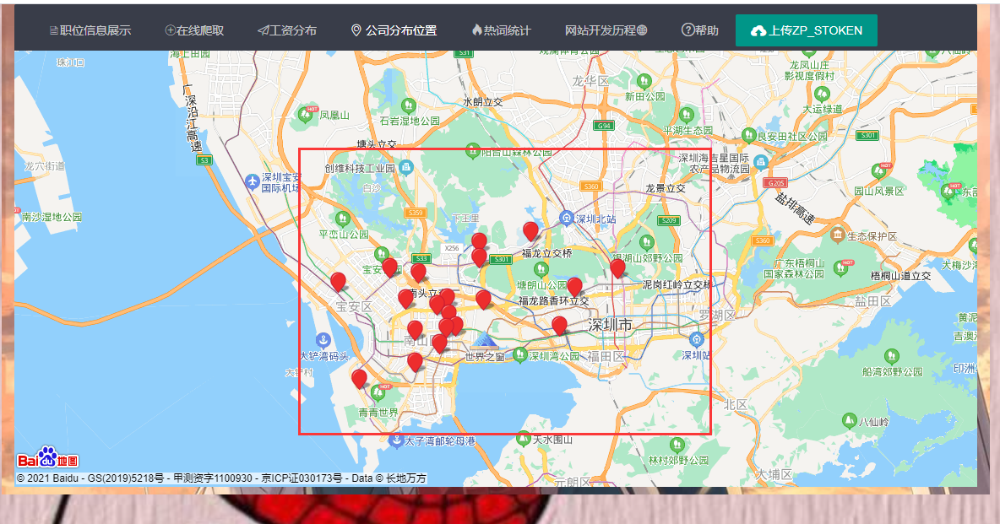

[查看演示](http://www.webappxin.com/)

## 技术栈

### 前端：jQuery+map.baidu+Encharts+jQCloud+layui

### 后端：SpringBoot+Mysql8.23+Thymeleaf+Mongodb+Mybatis+PageHelper+HttpClient&Jsoup+selenium

## 网站分析

### **页面url分析**

`https://www.zhipin.com/c101230100/y_4/?query=java%E5%BC%80%E5%8F%91%E5%AE%9E%E4%B9%A0%E7%94%9F&ka=sel-salary-4`

**Result**：`https://www.zhipin.com/c+城市序列id+/y_工资分段序号-s_规模序列号/?query=关键词&ka=sel-salary-工资分段序号`

### **城市序号：**

```txt
100010000 全国
直辖市
101010100  北京
101020100  上海
101040100  重庆
福建区号：10123         子号 ：  0100 福州 — 0900  南平 
广东区号：10128         子号 ：  0100 广州 — 2100  汕尾               
四川区号：10127         子号 ：  0100 成都 — 2100  甘孜藏族自治州  
贵州区号：10126         子号 ：  0100 贵阳 — 0600  六盘水
广西区号：10130         子号 ：  0100 南宁 — 1400  防城港    
```

### 说明：由于cookie设计到自己的登录之后才可大量进行爬取,我们最好进行登录cookie的获取,这里获取到的cookie就长期可爬

## 网站展示

### **首页**


### **在线爬取**


### **工资数据地区可视化**


### 某职位公司位置



### 热词统计


## 尾言自述

**本项目没有写的特别完美,本着对自己想要的需求的实现,这些功能也能满足大部分使用对自己想要搜寻的岗位进行查找分析了**
